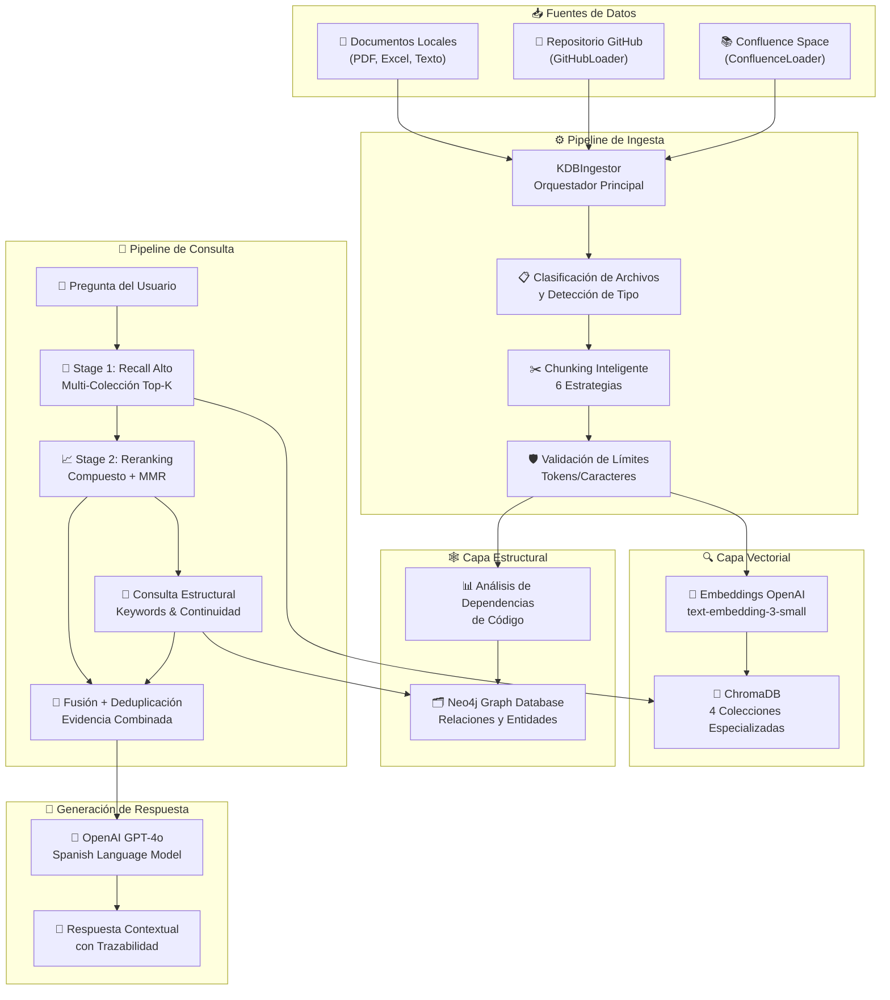
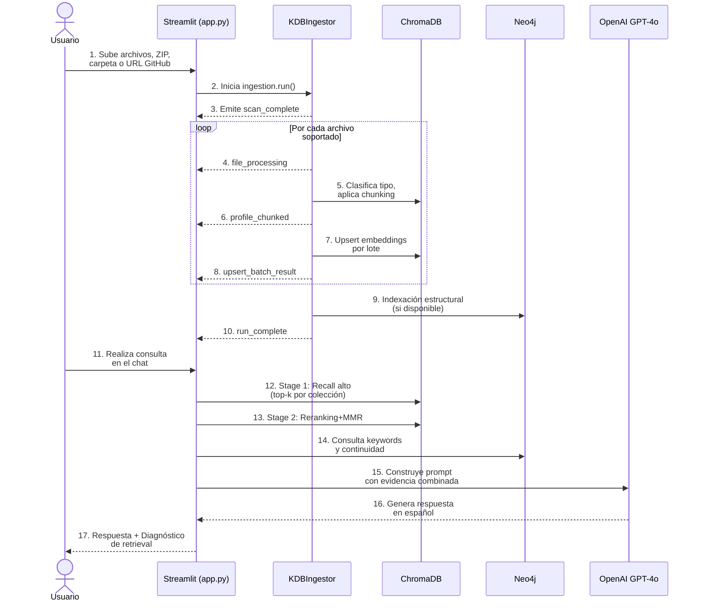

# 🕵️‍♂️ Auditor KDB Pro - RAG Híbrido con ChromaDB y Neo4j

[](https://www.python.org/downloads/)
[](LICENSE)
[](../../actions)
[](README.md)
[](https://streamlit.io/)

> **Sistema de Auditoría Técnica Inteligente** con Recuperación Aumentada por Generación (RAG) híbrida que combina búsqueda semántica en **ChromaDB** con análisis estructural en **Neo4j**, alimentado por **OpenAI GPT-4o**.

---

## 📋 Tabla de Contenidos

- [Descripción General](#descripción-general)
- [Características Principales](#características-principales)
- [Arquitectura del Sistema](#arquitectura-del-sistema)
- [Instalación](#instalación)
- [Configuración](#configuración)
- [Ejemplos de Uso](#ejemplos-de-uso)
- [Estructura del Proyecto](#estructura-del-proyecto)
- [Testing](#testing)
- [Troubleshooting](#troubleshooting)
- [Contribución](#contribución)
- [Licencia](#licencia)

---

## Descripción General

**Auditor KDB Pro** es una aplicación web interactiva construida con **Streamlit** que permite realizar auditorías técnicas complejas sobre repositorios de código, documentación y bases de conocimiento integradas desde múltiples fuentes.

### 🎯 Propósito

Proporcionar una plataforma integral para:
- **Análisis semántico** de documentación técnica y código fuente
- **Navegación estructural** de dependencias y relaciones de código
- **Respuestas contextuales** generadas mediante IA sobre preguntas técnicas
- **Consolidación de múltiples fuentes** (archivos locales, GitHub, Confluence, etc.)

---

## ✨ Características Principales

| Característica | Descripción | Estado |
|---|---|---|
| 🔍 **Búsqueda Semántica Multi-Colección** | ChromaDB con embeddings OpenAI en 4 colecciones especializadas | ✅ Activo |
| 🕸️ **Análisis de Grafo de Dependencias** | Neo4j para mapeo de relaciones de código y documentos | ✅ Activo |
| 📥 **Ingesta Multi-Formato** | PDF, Excel, Texto, Código, Configuración, Markdown | ✅ Activo |
| 🐙 **Integración GitHub** | Clonación automática y análisis de repositorios | ✅ Activo |
| 📚 **Integración Confluence** | Extracción y sincronización de espacios Confluence | ✅ Activo |
| 🧩 **Chunking Inteligente** | 6 estrategias de segmentación adaptadas por tipo de contenido | ✅ Activo |
| 🤖 **RAG Híbrido Bi-Etapa** | Recall alto + Reranking MMR para máxima precisión | ✅ Activo |
| 📊 **Telemetría en Tiempo Real** | Panel de diagnóstico de ingesta y retrieval | ✅ Activo |
| 🛡️ **Manejo Robusto de Errores** | Fallback vectorial si Neo4j no está disponible | ✅ Activo |

---

## Arquitectura del Sistema

### Diagrama de Componentes



### Flujo Operacional (Secuencia)



### Componentes Principales

#### 1. **KDBIngestor** (`ingestion.py`)

| Aspecto | Detalles |
|---|---|
| **Responsabilidad** | Orquestación completa del pipeline de ingesta |
| **Entrada** | Documentos desde `./documentos_fuente` (local, GitHub, Confluence) |
| **Procesamiento** | Clasificación → Chunking → Embeddings → Indexación |
| **Salida** | Índices en ChromaDB + Grafo en Neo4j |
| **Manejo de Errores** | Fallback vectorial si Neo4j no está disponible |

**Estrategias de Chunking Soportadas:**
- `char_overlap`: Ventanas deslizantes por caracteres
- `sentence_window`: Agrupación por oraciones con contexto
- `paragraph_window`: Segmentación por párrafos
- `heading_window`: Segmentación guiada por títulos
- `code_aware`: Optimizado para bloques de código

**Perfiles de Colección:**
```python
{
    "name": "kdb_small",
    "strategy": "sentence_window",
    "chunk_size": 700,
    "chunk_overlap": 120
},
{
    "name": "kdb_large",
    "strategy": "char_overlap",
    "chunk_size": 1800,
    "chunk_overlap": 220
},
{
    "name": "kdb_code",
    "strategy": "code_aware",
    "chunk_size": 1400
}
```

#### 2. **Motor de Consulta** (`app.py`)

| Etapa | Descripción |
|---|---|
| **Stage 1: Recall Alto** | Busca en todas las colecciones con `top-k=10` por colección |
| **Stage 2: Reranking** | Calcula score compuesto (distancia + señales léxicas) |
| **MMR Lambda** | Equilibra relevancia y diversidad de evidencia |
| **Evidencia Estructural** | Consulta Neo4j por keywords y relaciones de continuidad |
| **Fusión** | Deduplica y combina evidencia vectorial + estructural |

#### 3. **Loaders de Datos**

##### GitHubLoader (`scripts/github_loader.py`)
```python
loader = GitHubLoader(data_path="./documentos_fuente")
loader.fetch_repo("https://github.com/user/repo.git")
```

##### ConfluenceLoader (`confluence_loader.py`)
```python
loader = ConfluenceLoader(
    url="https://empresa.atlassian.net",
    username="user@empresa.com",
    api_token="tu_api_token"
)
docs = loader.fetch_space_content("SPACE_KEY")
```

---

## Instalación

### Requisitos Previos

- **Python** 3.9+
- **Git** (para clonar el repositorio)
- **pip** (gestor de paquetes)
- **OpenAI API Key** (obligatorio)
- **Neo4j** (opcional, para análisis estructural)

### Paso 1: Clonar el Repositorio

```bash
git clone https://github.com/gherrerz/KDB-Vector-Grafo.git
cd KDB-Vector-Grafo
```

### Paso 2: Crear Entorno Virtual

**En Windows (PowerShell):**
```powershell
python -m venv venv
.\venv\Scripts\Activate.ps1
```

**En Linux/macOS:**
```bash
python3 -m venv venv
source venv/bin/activate
```

### Paso 3: Actualizar pip e Instalar Dependencias

```bash
python -m pip install --upgrade pip
pip install -r requirements.txt
```

### Dependencias Principales

| Paquete | Versión | Propósito |
|---|---|---|
| `chromadb` | ≥0.5.0 | Vector database |
| `neo4j` | ≥5.0.0 | Graph database |
| `openai` | ≥1.0.0 | Embeddings y completions |
| `streamlit` | ≥1.18.1 | Framework web interactivo |
| `pydantic` | ≥2.0.0 | Validación de datos |
| `atlassian-python-api` | ≥3.41.11 | Integración Confluence |
| `beautifulsoup4` | ≥4.12.0 | Parsing HTML |
| `unstructured[all-docs]` | ≥0.6.1 | Extracción de documentos |
| `GitPython` | ≥3.1.40 | Operaciones Git |

### Paso 4: Configurar Variables de Entorno

Crear archivo `.env` en la raíz del proyecto:

```env
# OpenAI Configuration
OPENAI_API_KEY=sk-your-api-key-here
OPENAI_MODEL=gpt-4o

# Neo4j Configuration (opcional)
NEO4J_URI=bolt://localhost:7687
NEO4J_USER=neo4j
NEO4J_PASSWORD=your_secure_password
NEO4J_DATABASE=neo4j

# Confluence Configuration (opcional)
CONFLUENCE_URL=https://empresa.atlassian.net
CONFLUENCE_USER=user@empresa.com
CONFLUENCE_API_TOKEN=your_confluence_token
```

### Paso 5: Ejecutar la Aplicación

```bash
streamlit run app.py
```

La aplicación se abrirá en `http://localhost:8501`

---

## Configuración

### Archivo `.env` - Guía Completa

```env
# ========================================
# OPENAI - REQUERIDO
# ========================================
OPENAI_API_KEY=sk-proj-xxxxxxxxxx
# Obtener en: https://platform.openai.com/api-keys

OPENAI_MODEL=gpt-4o
# Opciones: gpt-4o, gpt-4-turbo, gpt-3.5-turbo

# ========================================
# NEO4J - OPCIONAL (para análisis estructural)
# ========================================
NEO4J_URI=bolt://localhost:7687
# Formato: bolt://hostname:port

NEO4J_USER=neo4j
NEO4J_PASSWORD=your_secure_password
NEO4J_DATABASE=neo4j

# ========================================
# CONFLUENCE - OPCIONAL (integración de espacios)
# ========================================
CONFLUENCE_URL=https://empresa.atlassian.net
CONFLUENCE_USER=user@empresa.com
CONFLUENCE_API_TOKEN=your_api_token_here
# Token API privado (no usar contraseña)
```

### Parámetros Configurables en `ingestion.py`

```python
# Estrategia de chunking global
chunk_strategy = "code_aware"  # ["all", "char_overlap", "sentence_window", ...]

# Límites de embedding
max_embedding_tokens = 8000
max_embedding_chars = 12000

# Límites de batch
max_batch_tokens = 7000
max_batch_items = 100
max_batch_chars = 18000

# Habilitar modo multi-colección
enable_multi_collection = True
```

---

## Ejemplos de Uso

### Ejemplo 1: Ingesta Programática en Python

```python
from ingestion import KDBIngestor

# Inicializar ingestor
ingestor = KDBIngestor(
    data_path="./documentos_fuente",
    db_path="./db_chroma_kdb"
)

# Ejecutar ingesta de documentos locales
ingestor.run()

# Ejecutar ingesta con repositorio GitHub
ingestor.run(github_url="https://github.com/user/repo.git")

# Ejecutar con documentos externos (Confluence)
extra_docs = [
    {
        "page_content": "Contenido de la página",
        "metadata": {
            "source": "confluence/SPACE/Title",
            "title": "Página de Confluence",
            "file_type": "confluence"
        }
    }
]
ingestor.run(extra_docs=extra_docs)
```

### Ejemplo 2: Consulta en Streamlit (UI Integrada)

**Paso 1:** Ejecutar la aplicación
```bash
streamlit run app.py
```

**Paso 2:** Cargar documentos en la sección **"Ingesta de Evidencia"**
- Subir archivos PDF, Excel, Texto
- O proporcionar URL de GitHub
- O conectar espacio Confluence

**Paso 3:** Esperar a que complete la indexación

**Paso 4:** Realizar consultas en el panel de chat
```
"¿Cuáles son las dependencias del módulo X?"
"Explica la arquitectura de autenticación"
"¿Qué cambios se hicieron recientemente?"
```

### Ejemplo 3: Integración Confluence Directa

```python
from confluence_loader import ConfluenceLoader
from ingestion import KDBIngestor

# Conectar a Confluence
loader = ConfluenceLoader(
    url="https://empresa.atlassian.net",
    username="user@empresa.com",
    api_token="tu_api_token"
)

# Obtener documentos de un espacio
docs = loader.fetch_space_content(space_key="KDBDOC", limit=50)

# Indexar en KDB
ingestor = KDBIngestor("./documentos_fuente", "./db_chroma_kdb")
ingestor.run(extra_docs=docs)

print(f"✅ {len(docs)} páginas de Confluence indexadas")
```

### Ejemplo 4: Consulta de Grafo en Neo4j

```python
from neo4j import GraphDatabase

driver = GraphDatabase.driver("bolt://localhost:7687", 
                            auth=("neo4j", "password"))

def find_dependencies(session, entity):
    result = session.run("""
        MATCH (e:CodeEntity)-[:DEPENDS_ON]->(dep:CodeEntity)
        WHERE e.name = $entity
        RETURN dep.name, dep.type
    """, entity=entity)
    
    for record in result:
        print(f"  → {record['dep.name']} ({record['dep.type']})")

with driver.session() as session:
    find_dependencies(session, "MyFunction")
```

---

## Estructura del Proyecto

```
KDB-Vector-Grafo/
│
├── 📄 app.py                              # Aplicación Streamlit principal
├── 📄 ingestion.py                        # Pipeline de ingesta y chunking
├── 📄 confluence_loader.py                # Loader para Confluence
├── 📄 pydantic_patch.py                   # Parches de compatibilidad
├── 📄 requirements.txt                    # Dependencias Python
├── 📄 readme.md                           # Este archivo
├── 📄 Prompt.md                           # Prompts del sistema
├── 📄 docker-compose.neo4j.yml            # Composición Docker para Neo4j
│
├── 📁 scripts/                            # Scripts auxiliares
│   ├── __init__.py
│   ├── github_loader.py                   # Clonación de repositorios GitHub
│   ├── check_neo4j.py                     # Validación de conectividad Neo4j
│   └── setup_neo4j.ps1                    # Setup automático Neo4j en Windows
│
├── 🧪 tests/                              # Suite de pruebas
│   └── test_ingestion_unit.py             # Tests unitarios de ingesta
│
├── 📁 documentos_fuente/                  # Directorio de documentos
│   ├── github_repo/                       # Repositorios GitHub clonados
│   └── [archivos subidos]                 # Archivos mediante UI
│
├── 📁 db_chroma_kdb/                      # Base vectorial ChromaDB
│   ├── chroma.sqlite3                     # Base de datos SQLite
│   └── [collections]/                     # Colecciones de embeddings
│
├── 📁 .github/                            # Configuración de GitHub
│   ├── agents/                            # Prompts para agentes IA
│   └── instructions/                      # Instrucciones de desarrollo
│
└── 🔧 .env (crear manualmente)            # Variables de entorno
```

### Descripción de Directorios y Archivos

| Ruta | Tipo | Descripción |
|---|---|---|
| `app.py` | Módulo | Interfaz Streamlit, retrieval híbrido, respuestas |
| `ingestion.py` | Módulo | Motor de ingesta, chunking, indexación vectorial/estructural |
| `confluence_loader.py` | Módulo | Cliente para extraer datos de Confluence |
| `scripts/github_loader.py` | Módulo | Clonación y procesamiento de repos GitHub |
| `scripts/check_neo4j.py` | Script | Diagnóstico de conectividad Neo4j |
| `tests/test_ingestion_unit.py` | Test | Suite unitaria para funciones críticas |
| `documentos_fuente/` | Directorio | Almacenamiento de documentos de ingesta |
| `db_chroma_kdb/` | Directorio | Base de datos vectorial persistente |

---

## Testing

### Ejecutar Suite Completa de Tests

```bash
python -m pytest tests/test_ingestion_unit.py -v
```

### Ejecutar Test Específico

```bash
python -m pytest tests/test_ingestion_unit.py::TestChunkingHelpers::test_split_text -v
```

### Validar Conectividad Neo4j

```bash
python ./scripts/check_neo4j.py
```

**Salida esperada:**
```
✅ Conexión a Neo4j exitosa
   URI: bolt://localhost:7687
   Usuario: neo4j
   Base de datos: neo4j
```

### Validar Instalación de Dependencias

```bash
python -m py_compile app.py ingestion.py confluence_loader.py
pip freeze | grep -E "chromadb|neo4j|openai|streamlit|atlassian"
```

---

## Troubleshooting

### ❌ Error: `OPENAI_API_KEY not found`

**Causa:** Variable de entorno no configurada

**Solución:**
1. Crear archivo `.env` en la raíz
2. Agregar: `OPENAI_API_KEY=sk-xxx`
3. Reiniciar la aplicación

```powershell
# Windows
echo "OPENAI_API_KEY=sk-your-key" > .env

# Linux/macOS
echo "OPENAI_API_KEY=sk-your-key" > .env
```

### ❌ Error: `chroma.sqlite3 locked`

**Causa:** Proceso anterior no cerró correctamente ChromaDB

**Solución (Windows):**
```powershell
Remove-Item .\db_chroma_kdb -Recurse -Force
New-Item .\db_chroma_kdb -ItemType Directory
```

**Solución (Linux/macOS):**
```bash
rm -rf ./db_chroma_kdb
mkdir ./db_chroma_kdb
```

### ❌ Error: `Neo4j connection refused`

**Causa:** Neo4j no está ejecutándose

**Soluciones:**
- Si necesitas Neo4j: `docker-compose -f docker-compose.neo4j.yml up -d`
- Si no lo necesitas: el sistema seguirá en modo vectorial
- Verificar: `python ./scripts/check_neo4j.py`

### ⚠️ Advertencia: `No documents found`

**Causa:** La carpeta `documentos_fuente` está vacía

**Solución:**
1. Colocar documentos en `./documentos_fuente`
2. O subir archivos mediante la UI de Streamlit
3. O proporcionar URL de GitHub/Confluence

### 🐢 Rendimiento Lento en Ingesta

**Causas comunes y soluciones:**

| Problema | Causa | Solución |
|---|---|---|
| Archivos muy grandes | Límites de embedding | Reducir `max_batch_tokens` en `ingestion.py` |
| Muchos archivos | Tiempo de procesamiento | Usar `enable_multi_collection=False` |
| Neo4j saturado | Índices sin optimizar | Crear índices en Neo4j: `CREATE INDEX ON :CodeEntity(name)` |
| Embeddings lentos | Rate limiting OpenAI | Aumentar tiempo de espera o usar modelo más pequeño |

---

## Contribución

### 🤝 Directrices para Contribuidores

1. **Fork** el repositorio
2. **Crear rama** de feature: `git checkout -b feature/mi-mejora`
3. **Commit** con mensajes descriptivos: `git commit -m "Agrega soporte para X"`
4. **Push** a la rama: `git push origin feature/mi-mejora`
5. **Pull Request** con descripción detallada

### Estándares de Código

- **Estilo:** PEP 8 (máximo 79 caracteres por línea)
- **Type hints:** Obligatorios en funciones públicas
- **Docstrings:** Formato Google o NumPy
- **Tests:** Incluir para nuevas funcionalidades

**Ejemplo de función con estándares:**

```python
def fetch_space_content(
    self,
    space_key: str,
    limit: int = 50
) -> list[dict[str, Any]]:
    """
    Extrae todas las páginas de un espacio Confluence.
    
    Args:
        space_key: Identificador del espacio (ej: "KDBDOC")
        limit: Cantidad máxima de páginas a recuperar (default: 50)
    
    Returns:
        Lista de diccionarios con contenido y metadata de páginas
        
    Raises:
        RuntimeError: Si la conexión a Confluence falla
    """
    # Implementación...
```

### 📋 Checklist pre-commit

- [ ] Tests unitarios pasan
- [ ] Código sigue PEP 8
- [ ] Docstrings completos
- [ ] Sin imports no utilizados
- [ ] README actualizado si aplica

---

## Licencia

Este proyecto está bajo la licencia **MIT**. Ver archivo [LICENSE](LICENSE) para más detalles.

### Resumen de Derechos

✅ **Permitido:**
- Uso comercial y privado
- Modificación del código
- Distribución
- Uso de patentes

❌ **No permitido:**
- Responsabilidad del autor
- Garantía de ningún tipo

📝 **Requerido:**
- Incluir aviso de licencia
- Documentar cambios significativos

---

## 📞 Soporte y Contacto

- **Issues:** [GitHub Issues](../../issues)
- **Discussions:** [GitHub Discussions](../../discussions)
- **Email:** contacto@ejemplo.com

---

## 🙏 Agradecimientos

- [OpenAI](https://openai.com/) - Modelos de embeddings y completions
- [Streamlit](https://streamlit.io/) - Framework web interactivo
- [ChromaDB](https://www.trychroma.com/) - Vector database
- [Neo4j](https://neo4j.com/) - Graph database
- [Comunidad Python](https://www.python.org/) - Ecosistema de desarrollo

---

**Última actualización:** Marzo 2026

**Versión:** 1.0.0

**Mantenedor:** [@gherrerz](https://github.com/gherrerz)
