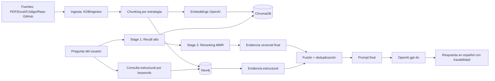
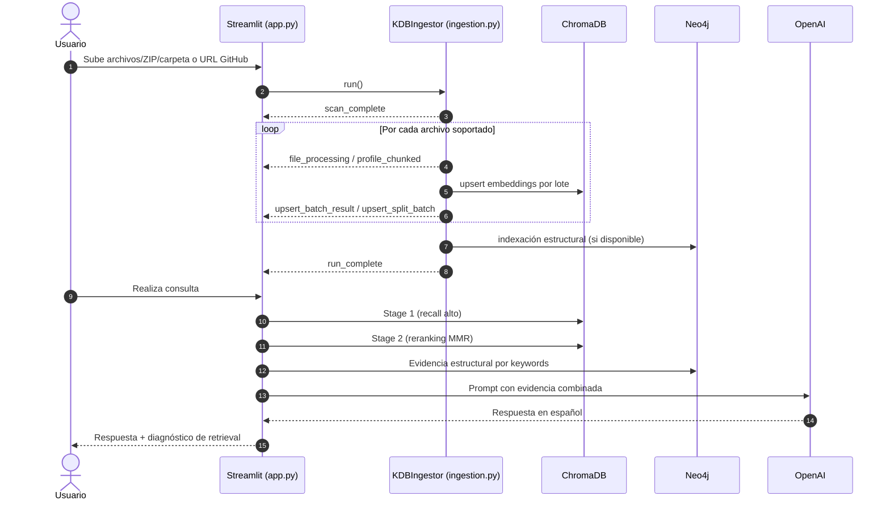

# 🕵️‍♂️ Auditor KDB Pro (RAG Híbrido)

Auditor KDB Pro es una aplicación de auditoría técnica en Streamlit que combina recuperación semántica y validación estructural para responder preguntas sobre repositorios y documentación técnica.

- Validación semántica: ChromaDB (embeddings OpenAI)
- Validación estructural: Neo4j (continuidad documental + grafo de código)
- Respuesta final: OpenAI Chat Completions (`gpt-4o`) en español

---

## ✅ Capacidades actuales

- Ingesta de PDF, Excel, texto, configuración y código fuente.
- Indexación multi-colección en ChromaDB (`kdb_principal`, `kdb_small`, `kdb_large`, `kdb_code`).
- Indexación en Neo4j de:
  - Flujo documental `Document -> Chunk -> NEXT`
  - Dependencias de código (`CodeFile`, `CodeEntity`, `DEPENDS_ON`)
- Consulta híbrida con pipeline en 2 etapas (recall + reranking MMR).
- Diagnóstico visible en UI: intención, Stage 1/2, cobertura y diversidad.
- Telemetría de ingesta en vivo (scan, chunking, batches, errores, cierre).

---

## ⚙️ Instalación y ejecución rápida

```powershell
python -m venv .venv
.\.venv\Scripts\Activate.ps1
python -m pip install --upgrade pip
pip install -r requirements.txt
python -m streamlit run app.py
```

Opcional (Neo4j local):

```powershell
powershell -ExecutionPolicy Bypass -File .\scripts\setup_neo4j.ps1 -Password "TuPasswordSeguro"
.\.venv\Scripts\python.exe .\scripts\check_neo4j.py
```

---

## 🧱 Arquitectura

### 1) Ingesta (`ingestion.py`)

Componente principal: clase `KDBIngestor`.

Responsabilidades:

- Descubrir y leer archivos desde `./documentos_fuente` (incluye carga de repo GitHub vía `GitHubLoader`).
- Clasificar tipo de archivo y aplicar estrategia de chunking por perfil.
- Controlar límites de embeddings con guardas de tokens/caracteres y split recursivo.
- Escribir embeddings en ChromaDB por colección.
- Escribir estructura en Neo4j:
  - `(:Document)-[:HAS_CHUNK]->(:Chunk)-[:NEXT]->(:Chunk)`
  - Entidades de código (`CodeFile`, `CodeEntity`) y relaciones `DEPENDS_ON`.
- Emitir eventos de progreso para UI (`scan_complete`, `file_processing`, `profile_chunked`, `upsert_*`, `run_complete`).

Notas de robustez:

- Si Neo4j no está configurado o no conecta, la ingesta sigue en modo vectorial.
- En errores `BadRequestError` de embeddings, divide lotes/chunks en vez de abortar proceso.

### 2) Consulta (`app.py`)

Componente principal: UI Streamlit + retrieval híbrido.

Pipeline de consulta:

- Stage 1 (alta cobertura):
  - Clasifica intención (`listing`, `counting`, `impact_analysis`, `bug_rootcause`, `architecture`, `security`, `performance`, `refactor_plan`, `how_it_works`).
  - Expande consulta y recupera candidatos con `top-k` por colección.
- Stage 2 (calidad):
  - Reranking por score compuesto (distancia + señales léxicas).
  - MMR para balancear relevancia y diversidad de evidencia.
- En paralelo:
  - Recupera evidencia estructural desde Neo4j por keywords y continuidad `prev/next`.
- Fusión:
  - Combina evidencia vectorial + estructural, deduplica y genera prompt final para OpenAI.

Diagnóstico de retrieval disponible en UI:

- `intent`, `stage1_k`, `stage1_raw`, `stage1_deduped`
- `stage2_scored`, `stage2_final`, `stage2_mmr_lambda`
- conteo de fuentes únicas recuperadas

### 3) Diagrama de solución (RAG Híbrido)



### 4) Secuencia operacional (paso a paso)

1. Usuario sube archivos, ZIP, carpeta local o URL GitHub.
2. `KDBIngestor.run()` obtiene documentos y emite `scan_complete`.
3. Para cada archivo soportado:
   - detecta tipo
   - aplica chunking
   - emite `file_processing` y `profile_chunked`
4. Upsert en lotes a Chroma:
   - controla límites de tokens/chars
   - si falla un lote, divide y reintenta (`upsert_split_batch`)
5. Indexación estructural en Neo4j (si disponible).
6. Usuario realiza consulta en chat.
7. `app.py` ejecuta Stage 1 + Stage 2 y consulta grafo.
8. Se combina evidencia, se construye prompt y se invoca OpenAI.
9. UI muestra respuesta y diagnóstico de recuperación.

Diagrama operacional:



---

## ✂️ Estrategias de chunking

El sistema soporta estrategias seleccionables y perfiles por colección.

Estrategias disponibles:

- `char_overlap`: ventanas por caracteres con solapamiento.
- `sentence_window`: ventanas por oraciones con solapamiento de contexto.
- `paragraph_window`: agrupación por párrafos adyacentes.
- `heading_window`: segmentación guiada por encabezados.
- `code_aware`: segmentación orientada a bloques/código.

Perfiles activos (multi-colección):

- `kdb_small`: `sentence_window`, chunks más pequeños para precisión semántica.
- `kdb_large`: `char_overlap`, chunks grandes para cobertura/contexto.
- `kdb_code`: `code_aware`, optimizado para repositorios y dependencias.

Controles de seguridad de embedding:

- límite de tokens por batch
- límite de caracteres por batch
- límite de tokens/caracteres por chunk
- división recursiva ante overflow

---

## 📁 Estructura del proyecto

```text
.
├── app.py
├── ingestion.py
├── pydantic_patch.py
├── requirements.txt
├── readme.md
├── Prompt.md
├── docker-compose.neo4j.yml
├── scripts/
│   ├── check_neo4j.py
│   ├── github_loader.py
│   └── setup_neo4j.ps1
├── tests/
│   └── test_ingestion_unit.py
├── documentos_fuente/
│   └── ...
└── db_chroma_kdb/
    └── ...
```

Descripción rápida:

- `app.py`: UI Streamlit, retrieval híbrido y generación de respuestas.
- `ingestion.py`: pipeline de ingesta, chunking, indexación Chroma/Neo4j.
- `scripts/github_loader.py`: clonación/limpieza de repositorios para ingesta.
- `scripts/check_neo4j.py`: prueba de conectividad Neo4j.
- `tests/test_ingestion_unit.py`: pruebas unitarias de helpers críticos de ingesta.

---

## 🔐 Variables de entorno

Esperadas en `.env`:

- `OPENAI_API_KEY`
- `OPENAI_MODEL` (opcional)
- `NEO4J_URI`
- `NEO4J_USER`
- `NEO4J_PASSWORD`
- `NEO4J_DATABASE`

---

## 🧪 Validación recomendada

```powershell
.\.venv\Scripts\python.exe -m unittest tests/test_ingestion_unit.py
```

Para verificar conectividad de grafo:

```powershell
.\.venv\Scripts\python.exe .\scripts\check_neo4j.py
```

---

## 🛠️ Problemas comunes

- Error de lock en `db_chroma_kdb/chroma.sqlite3` en Windows:
  - cerrar procesos Python/Streamlit
  - limpiar carpeta `db_chroma_kdb`
  - reiniciar app
- Si Neo4j no conecta:
  - el sistema sigue en modo vectorial
  - revisar variables de entorno y credenciales
