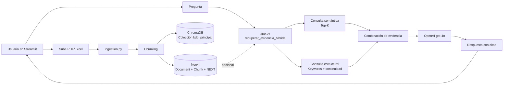
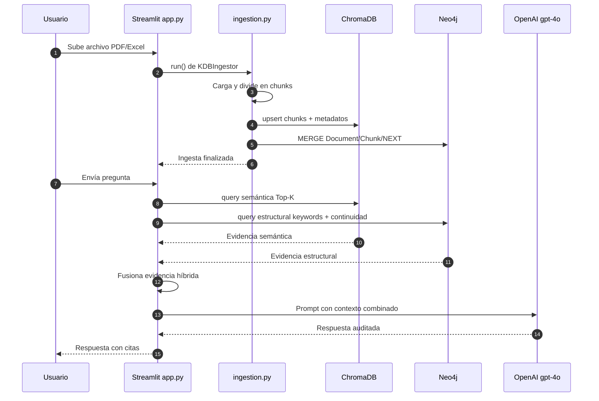

# 🕵️‍♂️ Auditor KDB Pro (RAG Híbrido)

Auditor KDB Pro es una aplicación de auditoría técnica con Streamlit que implementa un **RAG híbrido**:

- **Validación semántica:** ChromaDB (similitud vectorial)
- **Validación estructural:** Neo4j (grafo de continuidad documental)

El sistema responde en español, cita fuentes y mantiene trazabilidad basada en evidencia.

---

## ✅ Funcionalidades

- Ingesta de documentos `.pdf`, `.xlsx`, `.xls`
- Ingesta recursiva de texto y código fuente (`.py`, `.js`, `.ts`, `.java`, `.md`, `.txt`, etc.)
- Fragmentación de texto en chunks con solapamiento
- Indexación semántica en ChromaDB
- Indexación estructural en Neo4j con:
  - `(:Document)-[:HAS_CHUNK]->(:Chunk)`
  - `(:Chunk)-[:NEXT]->(:Chunk)`
- Consulta híbrida en tiempo real para reforzar precisión de respuesta

---

## 🧱 Arquitectura

### 1) Ingesta (`ingestion.py`)

1. Carga documentos desde `./documentos_fuente`
   - Incluye subcarpetas (útil para repositorios completos)
2. Divide texto en chunks
3. Hace `upsert` en colección ChromaDB `kdb_principal`
4. Construye/actualiza grafo en Neo4j:
   - Nodo `Document` por archivo
   - Nodo `Chunk` por fragmento
   - Relación `HAS_CHUNK` y `NEXT`

### 2) Consulta (`app.py`)

1. Recupera evidencia semántica desde ChromaDB
2. Recupera evidencia estructural desde Neo4j por keywords
3. Combina ambas evidencias y arma prompt final
4. Genera respuesta con OpenAI (`gpt-4o`)

Si Neo4j no está configurado, la app funciona en modo vectorial sin romperse.

### 3) Diagrama de solución (RAG Híbrido)



### 4) Secuencia operacional (paso a paso)



---

## ✂️ Estrategias de chunking (solo descomentando)

En `ingestion.py`, dentro de `KDBIngestor.__init__`, deja activa **solo una** de estas líneas:

```python
self.chunk_strategy = "char_overlap"
# self.chunk_strategy = "sentence_window"
# self.chunk_strategy = "paragraph_window"
# self.chunk_strategy = "heading_window"
# self.chunk_strategy = "code_aware"
```

Opciones disponibles:

- `char_overlap` (actual por defecto): chunks por tamaño fijo + overlap.
- `sentence_window`: ventanas por oraciones con solapamiento semántico.
- `paragraph_window`: ventanas por párrafos (mejor para informes/tablas narradas).
- `heading_window`: prioriza secciones por encabezados (Markdown o títulos numerados).
- `code_aware`: intenta separar por bloques de código (funciones/clases) y luego ventana por líneas.

Parámetros que puedes ajustar en el mismo `__init__`:

- `chunk_size`, `chunk_overlap`
- `sentence_window_size`, `sentence_overlap`
- `paragraph_window_size`, `paragraph_overlap`
- `code_line_window`, `code_line_overlap`

---

## 🧠 Multi-colección / Multi-vector (implementado)

La ingesta ahora puede guardar embeddings en **múltiples colecciones** con diferentes estrategias de chunking en una sola corrida:

- `kdb_small`: chunks pequeños orientados a precisión semántica.
- `kdb_large`: chunks grandes orientados a más contexto (perfil principal para grafo).
- `kdb_code`: chunks orientados a código (`code_aware`).

Configuración en `ingestion.py`:

```python
self.enable_multi_collection = True
# self.enable_multi_collection = False
```

Si `False`, vuelve al modo clásico con una sola colección (`kdb_principal`) usando `self.chunk_strategy`.

Además, cada vector guarda metadatos para filtrar búsquedas:

- `source`
- `file_type`
- `chunk_strategy`
- `collection`
- `parent_id` (vincula multi-vector del mismo documento base)
- `position`

---

## 🔎 Filtros en consulta (UI)

En el sidebar de `app.py` ahora puedes filtrar recuperación vectorial por:

- **Estrategia de chunk** (`all`, `char_overlap`, `sentence_window`, etc.)
- **Colección** (`all`, `kdb_small`, `kdb_large`, `kdb_code`, etc.)

La app consulta una o varias colecciones, combina resultados y deduplica por `parent_id`.

---

## 💻 Repositorios de código + documentación

Para que el sistema lea, guarde y entienda código fuente junto con documentación:

1. Copia el repo (o carpeta del repo) dentro de `./documentos_fuente/`.
2. Ejecuta **Indexar Nueva Evidencia** en la app.
3. Recomendación de estrategia:
   - Código: `code_aware`
   - Documentación técnica (`README`, specs): `heading_window` o `paragraph_window`

Tip práctico: si vas a indexar mezcla de código + docs en una sola corrida, empieza con `code_aware` y luego prueba `heading_window` para comparar calidad de respuesta.

---

## 📁 Estructura del proyecto

```text
.
├── app.py
├── ingestion.py
├── requirements.txt
├── .env.example
├── docker-compose.neo4j.yml
├── scripts/
│   ├── setup_neo4j.ps1
│   └── check_neo4j.py
├── documentos_fuente/
└── db_chroma_kdb/
```

---

## ⚙️ Variables de entorno

Crea `.env` a partir de `.env.example`:

```dotenv
OPENAI_API_KEY=YOUR_OPENAI_API_KEY
OPENAI_MODEL=text-embedding-3-small

NEO4J_URI=bolt://localhost:7687
NEO4J_USER=neo4j
NEO4J_PASSWORD=YOUR_NEO4J_PASSWORD
NEO4J_DATABASE=neo4j
```

---

## 🐳 Instalación de Neo4j (recomendada en Windows)

Prerequisito: Docker Desktop instalado y en ejecución.

1. Inicializa Neo4j + configura `.env` automáticamente:

```powershell
powershell -ExecutionPolicy Bypass -File .\scripts\setup_neo4j.ps1 -Password "TuPasswordSeguro"
```

2. Verifica conectividad real desde el proyecto:

```powershell
.\.venv\Scripts\python.exe .\scripts\check_neo4j.py
```

3. (Opcional) Abrir Neo4j Browser:

- URL: `http://localhost:7474`
- User: `neo4j`
- Password: el valor usado en `-Password`

4. Para detener Neo4j:

```powershell
powershell -ExecutionPolicy Bypass -File .\scripts\setup_neo4j.ps1 -Stop
```

---

## 🛠️ Instalación y ejecución

```powershell
python -m venv .venv
.\.venv\Scripts\Activate.ps1
python -m pip install --upgrade pip
pip install -r requirements.txt
powershell -ExecutionPolicy Bypass -File .\scripts\setup_neo4j.ps1 -Password "TuPasswordSeguro"
.\.venv\Scripts\python.exe .\scripts\check_neo4j.py
python -m streamlit run app.py
```

---

## 🔎 Verificación rápida E2E

1. Inicia la app con Streamlit
2. Sube uno o más documentos en el sidebar
3. Pulsa **Indexar Nueva Evidencia**
4. Verifica en UI:
   - “Neo4j conectado” si está configurado
   - consulta responde con citas de fuente

---

## 📦 Dependencias clave

- `chromadb==0.4.22`
- `openai>=1.0.0`
- `neo4j>=5.0.0`
- `pydantic>=1.10.0,<2.0.0`
- `streamlit>=1.18.1`

---

## 🧯 Problemas comunes

- **Falta `OPENAI_API_KEY`:** la UI detiene ejecución con mensaje de error.
- **Neo4j no responde:** la app entra en modo solo vectorial.
- **Dependencias de `unstructured` en Windows:** puede requerir Build Tools.
- **Documentos no actualizados:** reindexa desde sidebar tras subir archivos.

---

## 📌 Nota de seguridad

No publiques claves reales en `.env.example` ni en commits.
Si una clave se expone, rótala inmediatamente.